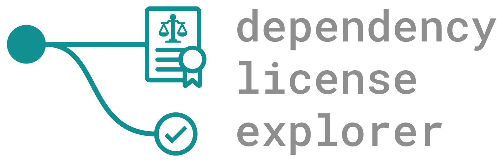

Given dependency information this Open Source software generates a tree-based view of the licenses and indicates potential problems. 
Per dependency it requires: license information, name, and GAV. It also requires a tree-structure of the dependencies. *(Refer to the example projects for more details.)* The files in the examples were generated by the IDE; so you do not have to create them yourself. It is fairly easy to match this style, so if you use something other than Maven just convert manually it to this format. **We are open to support project types - please leave suggestions.** 

Generated display is HTML/CSS only and can be saved; any **modern** browser will support this - we recommend **Google Chrome**. However, certain features, like the current branch and jump-to, will not be available in the save. To <s>edit/</s>view more detailed dependency information, as well as generating displays in the first place, requires only vanilla JavaScript.

**No 3rd party assets** have been, or will be, used.

- [x] HTML/CSS only tree-structure view
- [x] Warning (missing license) paths
- [x] Error (blacklisted license) paths
- [ ] Generate `HTML` from `JSON`
- [ ] <s>Export `JSON` data</s> <b>Won't do</b>
- [x] Display<s>/edit</s> dependency details
- [x] Allow overwriting of module licenses
- [x] Allow aliases/synonyms of licenses
- [x] Whitelist/blacklist license customisation
- [x] Project overview/summary
- [x] Directory scan; automate file loading
- [ ] <s>Hot loading</s>

Editing and hot loading cannot be done due to the restraints with the `file` protocol. A version that runs on a server is being developed, and this will be capable of editting files and listening to changes.  

If you just want to use this software please use the `releases` tab above and download the latest version, do not clone or fork this repository.
